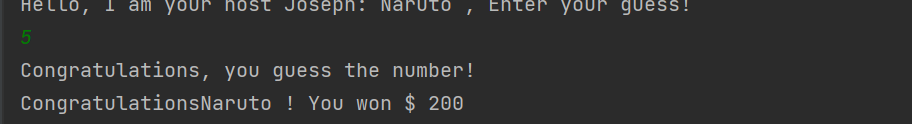

# Lesson 3 Output 
## User Enter's First Name & Option for Last Name

## Host name is displayed with message to enter your guess of number

## Program will display if the guess was too high or too low 
### program will display money and the amount player is losing each time player guesses wrong number of host

## Player guesses the right number and get's congrats message

## Player get's asked again if they want to play the game 
